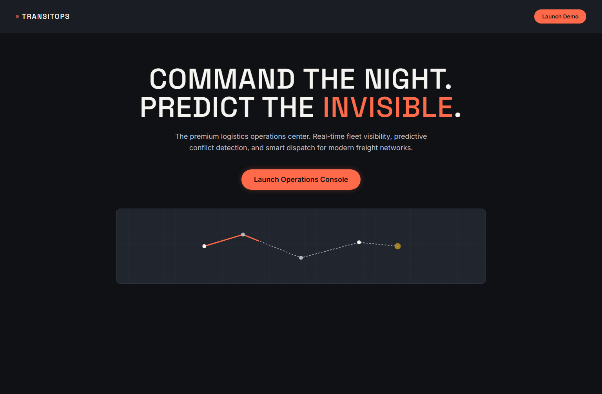
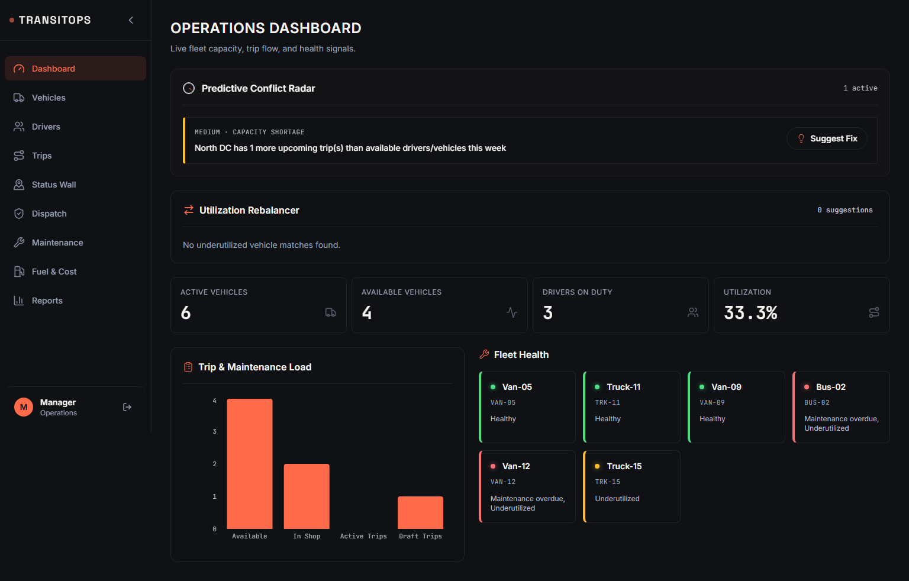
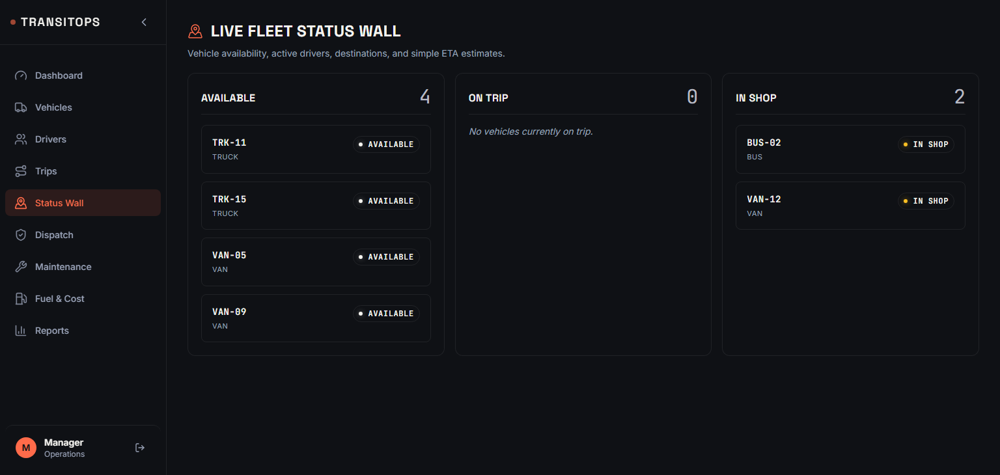
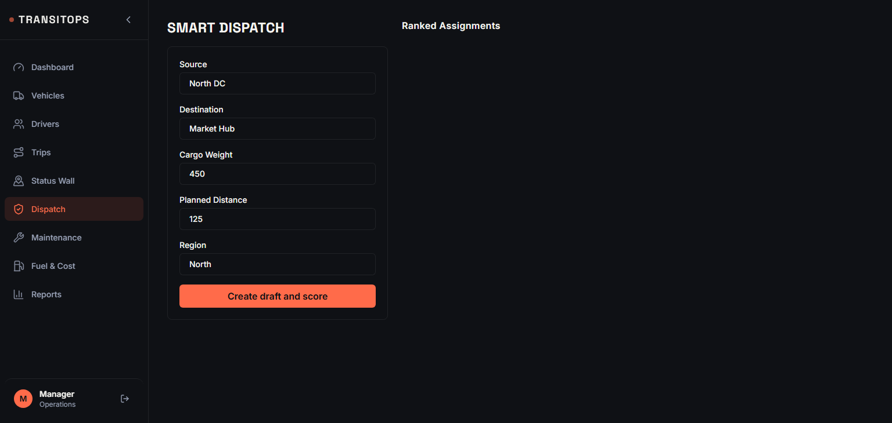

# TransitOps

<div align="center">
  
</div>

<div align="center">
  <h3>Command the Night. Predict the Invisible.</h3>
  <p>The premium logistics operations center. Real-time fleet visibility, predictive conflict detection, and smart dispatch for modern freight networks.</p>
</div>

---

## ⚡ Overview

TransitOps is a next-generation command center designed specifically for modern fleet operators. It replaces chaotic spreadsheet dispatching with a live, predictive "Status Wall" and "Conflict Radar," designed with a premium, dark-mode-first aesthetic known as **Night Freight**.

Whether you're dispatching a dozen vehicles or tracking a hundred long-haul routes, TransitOps provides instant visibility into fleet health, driver availability, and potential operational bottlenecks before they happen.


'
```powershell
cd <path-to-TransitOps>
docker compose up --build -d
```

Run migrations:

```powershell
docker compose exec backend alembic upgrade head
```

Seed demo data:

## 🚀 Key Features

### 1. Operations Dashboard
A centralized command view giving you instant readouts on fleet utilization, active trips, and open maintenance requests. The dashboard surfaces critical KPIs so you never have to hunt for the status of your operations.

<div align="center">
  
</div>

### 2. Status Wall
Ditch the whiteboard. The Status Wall provides a live kanban-style view of your entire fleet, instantly categorizing vehicles into:
- **Available**: Ready for dispatch.
- **On Trip**: Currently deployed with live routing.
- **In Shop**: Grounded for maintenance or inspection.

<div align="center">
  
</div>

### 3. Smart Dispatch & Conflict Radar
Stop guessing which driver should take which trip. Smart Dispatch intelligently ranks available drivers and vehicles, surfacing potential issues via the **Conflict Radar**:
- **Hours of Service**: Flags drivers approaching their legal driving limits.
- **Maintenance Due**: Prevents dispatching vehicles with overdue inspections.
- **Utilization Balancing**: Recommends drivers and vehicles to ensure even workload distribution.

<div align="center">
  
</div>

---

## 🛠️ Technology Stack

TransitOps is built with a modern, scalable architecture:

- **Frontend**: React 18, TypeScript, Vite, Tailwind CSS (Custom "Night Freight" Design System)
- **Backend**: Python, FastAPI, SQLAlchemy (Async), Pydantic
- **Database**: PostgreSQL (managed via Docker)
- **Containerization**: Docker & Docker Compose for seamless local development

---

## 🚦 Getting Started

### Prerequisites
- [Docker Desktop](https://www.docker.com/products/docker-desktop) installed and running.
- Node.js (if you want to run the frontend outside of Docker).

### Running Locally

TransitOps is fully containerized. You can spin up the entire stack (Database, Backend API, Frontend UI) with a single command:

```bash
# Clone the repository
git clone https://github.com/Kunalchandra007/TransitOps.git
cd TransitOps

# Start the stack
docker compose up --build
```

The application will be available at:
- **Frontend App**: [http://localhost:5173](http://localhost:5173)
- **Backend API Docs**: [http://localhost:8000/docs](http://localhost:8000/docs)

### Test Credentials
To access the Operations Console, use the following demo credentials:
- **Email:** `manager@transitops.io`
- **Password:** `TransitOps123`

---

## 📁 Project Structure

```
TransitOps/
├── backend/            # FastAPI application
│   ├── app/
│   │   ├── api/        # REST API Routes
│   │   ├── models/     # SQLAlchemy Models
│   │   ├── schemas/    # Pydantic validation
│   │   └── services/   # Business Logic (Smart Dispatch)
│   └── requirements.txt
├── frontend/           # React + Vite application
│   ├── src/
│   │   ├── components/ # Reusable UI components
│   │   ├── pages/      # App views (Dashboard, Status Wall, etc.)
│   │   └── context/    # React Context (Auth)
│   ├── tailwind.config.js
│   └── package.json
└── docker-compose.yml  # Local environment orchestration
```

---

<div align="center">
  <p>Built for modern logistics.</p>
</div>
